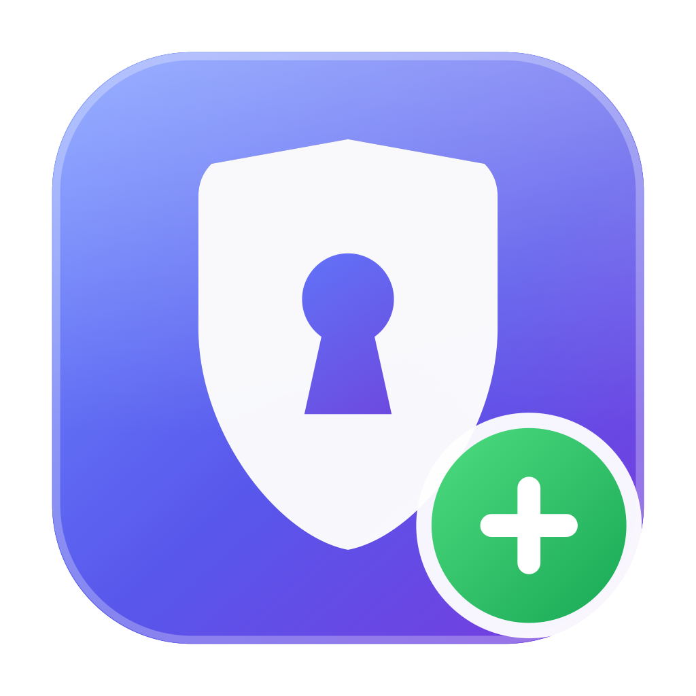

<div align="center">



# TCC 权限助手

**macOS 隐私权限（TCC）图形化管理工具**

选择应用 → 自动读取 Bundle ID → 勾选权限 → 后台调用 tccplus

[](LICENSE)

-success)


</div>

---

## 这是什么

macOS 的隐私授权记录在 TCC 数据库里。有些场景下系统设置面板并不好用——比如应用被误拒后不再弹窗、需要批量改一批应用、或者想让某个工具直接拿到摄像头权限而不走弹窗流程。

命令行工具 [tccplus](https://github.com/jslegendre/tccplus) 能直接改这个数据库，但每次都要手动查 Bundle ID、拼命令。这个工具给它套了一层图形界面：拖进一个 `.app`，勾两个框，点执行。

**自带一个 tccplus 兼容实现**，开箱即用，不需要额外安装任何东西。

## 截图与功能

| | |
|---|---|
| **选择应用** | 拖拽 `.app` 进窗口、系统文件面板浏览，或从带搜索的已安装应用列表里选 |
| **自动识别** | 从 `Info.plist` 读出 Bundle ID、名称、版本、图标，Bundle ID 可一键复制 |
| **权限项** | 默认显示麦克风、摄像头；展开后还有屏幕录制、辅助功能、输入监控、完全磁盘访问、自动化、照片 |
| **三种操作** | `add` 授权 / `remove` 拒绝 / `reset` 重置（下次重新弹窗） |
| **执行反馈** | 逐条执行，命令行与输出实时显示在日志区，可选中复制 |
| **权限提升** | 「以管理员权限运行」通过系统密码框提权，无需终端 |

## 安装

从 [Releases](../../releases) 下载 `.dmg`，拖进「应用程序」即可。通用二进制，Apple Silicon 与 Intel 都能跑，要求 macOS 13+。

应用是 ad-hoc 签名、未经 Apple 公证的，首次打开会被 Gatekeeper 拦下。右键图标选「打开」，或：

```bash
xattr -dr com.apple.quarantine "/Applications/TCC 权限助手.app"
```

## 自行构建

```bash
./build.sh              # 本机架构，快
./build.sh --universal  # arm64 + x86_64 通用二进制
./package.sh            # 打成 dist/*.dmg 与 *.zip，附 SHA256SUMS
open "build/TCC 权限助手.app"
```

用 `swiftc` 直接编译打包，**不需要 Xcode 工程**，只要有 Command Line Tools 即可；构建脚本会自动生成图标、编译界面与内置 tccplus，并做 ad-hoc 签名。

## 使用

1. **选应用** —— 拖 `.app` 进虚线框，或用「选择应用…」/「已安装列表」。Bundle ID 自动填好。
2. **勾权限** —— 默认麦克风 + 摄像头；勾「显示更多权限」展开其余六项。
3. **选操作** —— `add` / `remove` / `reset`，下方有一句话说明各自效果。
4. **点执行** —— 每个勾选项调一次 tccplus，输出汇总到日志区。

> 改完权限需要**退出并重新启动目标应用**才会生效。

## 权限要求

修改 TCC 数据库要求调用方拥有**完全磁盘访问**权限，这是系统限制，绕不过去：

- 「以管理员权限运行」会跟随勾选自动开关：只有屏幕录制、辅助功能、输入监控、完全磁盘访问位于系统级数据库、需要 root，其余在用户级库，有完全磁盘访问即可，不必提权。
- 需要提权时只在**首次执行**验证一次密码，之后 5 分钟内免密——App 持有一个 `AuthorizationRef` 并复用（`system.privilege.admin` 的系统默认有效期）。界面会显示剩余秒数，可随时点「释放」立即失效。
- 如果仍然失败，去 **系统设置 → 隐私与安全性 → 完全磁盘访问**，把 `TCC 权限助手.app` 加进去。
- 提权执行走 `AuthorizationExecuteWithPrivileges`（该符号在 Swift 中被标为 unavailable，运行时用 `dlsym` 取指针调用）；取不到时自动回退到 `osascript … with administrator privileges`，那条路径每次都会弹框。
- 少数受 SIP 保护的条目可能需要关闭 SIP —— 这是 TCC 本身的限制，不是本工具的。

## 内置的 tccplus

`Sources/tccplus.swift` 是一个参数兼容 tccplus 的命令行工具，打包在 `Contents/Resources/tccplus`：

```
tccplus <add|remove|reset> <service> <bundle-id> [app-path]
```

| 动作 | 效果 |
|---|---|
| `add` | `auth_value = 2`（已允许） |
| `remove` | `auth_value = 0`（已拒绝，不再弹窗） |
| `reset` | 删除记录，应用下次请求时重新弹窗 |

`service` 支持短名（`Camera`、`Microphone`、`ScreenCapture`、`Accessibility`、`ListenEvent`、`SystemPolicyAllFiles`、`AppleEvents`、`Photos` …）或完整的 `kTCCService*` 名称。

实现要点：

- **数据库自动路由** —— 辅助功能、屏幕录制、输入监控、完全磁盘访问等走系统级 `/Library/Application Support/com.apple.TCC/TCC.db`，摄像头、麦克风、照片、自动化等走用户级 `~/Library/Application Support/com.apple.TCC/TCC.db`。
- **列结构探测** —— 先 `PRAGMA table_info(access)` 再拼 INSERT，兼容各 macOS 版本的列差异（包括 10.14 的 `allowed` 与 10.15+ 的 `auth_value`）。
- **写入 csreq** —— 传入 `app-path` 时用 `SecCodeCopyDesignatedRequirement` 算出该应用的代码签名要求写进 `csreq` 列，条目更不容易被系统判为无效。GUI 会自动传这个参数。

> 注意：`csreq` 记录的是目标应用**当前**的签名。应用更新后签名若发生变化，条目可能失效，重跑一次即可。

### 换用官方 tccplus

把 [jslegendre/tccplus](https://github.com/jslegendre/tccplus) 的二进制放到项目根目录，`build.sh` 会优先打包它，界面此时自动不传第 4 个参数以保持兼容。

查找顺序：界面右上角「…」手动指定的路径 → App 内置 → `/usr/local/bin` → `/opt/homebrew/bin` → `~/bin` → 登录 shell 的 `PATH`。右上角圆点绿色表示就绪。

## 项目结构

```
├── Sources/
│   ├── App.swift          SwiftUI 界面与执行逻辑
│   └── tccplus.swift      内置的 tccplus 兼容 CLI
├── Tools/
│   └── MakeIcon.swift     CoreGraphics 矢量绘制图标
├── .github/workflows/
│   ├── ci.yml             push / PR 时构建并校验产物
│   └── release.yml        打 v* tag 时构建通用二进制并发布 Release
├── build.sh               生成图标 + 编译 + 签名
├── package.sh             打 DMG / ZIP + 校验和
└── LICENSE
```

图标由 `Tools/MakeIcon.swift` 用 CoreGraphics 纯代码绘制——盾牌、钥匙孔、渐变、`+` 徽章都是矢量路径，10 个尺寸各自独立渲染（而非缩放大图）以保证小尺寸下依然锐利，最后由 `iconutil` 打成 `.icns`。改配色或造型直接改这个文件重新构建即可。

## 发布流程

打一个 `v` 开头的 tag 即可，GitHub Actions 会在 macOS runner 上构建通用二进制、打出 DMG 与 ZIP、生成 SHA256 校验和并创建 Release：

```bash
git tag v1.0.0
git push origin v1.0.0
```

也可以在 Actions 页面手动触发 **Release** 工作流并填入版本号。版本号会经 `APP_VERSION` 写进 `Info.plist` 的 `CFBundleShortVersionString`。

## 免责声明

本工具会直接修改系统隐私数据库，请只用在自己的机器和自己信任的应用上。绕过权限弹窗意味着你在替系统做安全判断——清楚自己在授权什么。作者不对任何由此产生的后果负责。

## 许可

[MIT](LICENSE) © 2026 cuijianzhuang
